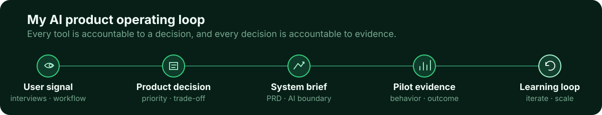

<!--
THESIS: Richard's profile is an evidence trail from messy user workflow to measurable AI pilot; it refuses the generic badge-first developer profile.
OWN-WORLD: Deep forest surfaces, mint signals, thin operational linework, and compact evidence labels form a calm product-control language.
STORY: A recruiter sees Richard's position, verifies three products and quantified outcomes, understands his operating method and experience, then contacts him.
FIRST VIEWPORT: A full-width signal board names Richard, states the AI Product Manager position, surfaces three proof points, and moves one signal from Discover to Pilot.
FORM: Product signal console, the brief-pinned direction overriding the concept roll; seed 68ad3d16.
FINISH: unreviewed and undocumented is unfinished; this build ends with the finish review, the verdict, DESIGN.md, and every shipping raster carrying its provenance
-->

  <picture>
    <source media="(max-width: 1200px)" srcset="./assets/hero-mobile.svg" />
    
  </picture>

  
  

I turn complex, manual workflows into AI products that teams can test, measure, and trust. My work sits between user discovery, product strategy, technical PRDs, and cross-functional delivery—close enough to the system to make sound product decisions, and close enough to users to know whether those decisions matter.

I currently build as an **iOS Developer in the Apple Developer Academy program**, strengthening hands-on engineering execution while completing my **Informatics Engineering degree at Universitas Brawijaya** (expected 2027). I am open to **AI Product Manager opportunities across Indonesia, Singapore, and global remote teams**.

## Product evidence

- **35% less food waste and related loss** — reported by pilot users during Kulkita's first two weeks at UB Coffee.
- **IDR 26 million in non-dilutive funding** — secured for Kulkita.
- **30+ competition awards and recognitions** — five selected national highlights are listed below.
- **60% faster internal information retrieval** — measured in Pingtar's internal AI pilot evaluation.

## What I have built

### Kulkita — predictive fresh-goods operations

**Problem.** High-volume kitchens lose fresh inventory because expiry risk is difficult to see early and stock rotation is inconsistent.

**My product work.** I founded Kulkita and led four engineers from field discovery to a market-ready MVP. I owned the roadmap, PRD, AI system direction, product flows, pilot execution, stakeholder management, and go-to-market work. The system combines FIFO operations with predictive freshness tracking so kitchen teams can act before spoilage becomes loss.

**Evidence.** Pilot users at UB Coffee reported a **35% reduction in food waste and related financial loss during Kulkita's first two weeks**. The product also secured **IDR 26 million in non-dilutive funding**.

> **What it proves:** 0→1 product leadership, AI-enabled operations, cross-functional execution, and pilot ownership.

### Sentra — accessible financial independence

**Problem.** Many banking and e-KYC experiences still require assistance from people with visual impairments, limiting privacy and independence.

**My product work.** I led product thinking and accessible experience design after research with **seven stakeholders**. The MVP explored voice-guided e-KYC, money recognition, voice-based budgeting, and accessible QRIS payments. I translated the research into product decisions, wireframes, and a Scrum-led development path.

**Evidence.** Sentra earned **2nd place in the UNITY Software Development Competition**, selected from **367 participants across 39 universities**.

> **What it proves:** inclusive discovery, accessibility-led prioritization, and turning underserved-user insight into a testable MVP.

### Fiona — AI-assisted accounting cycle

**Problem.** Accountants still spend significant time manually moving data from receipts through the accounting cycle before a usable financial statement is ready.

**My product work.** As Product Manager, I interviewed accountants, translated their operational requirements into a technical PRD, and coordinated **two AI engineers and one software engineer**. Fiona uses **GPT through OpenRouter** to automate document-to-statement work so accountants can shift their attention from producing every entry to validating AI output.

**Evidence.** The product has reached a **client pilot** and is being tested by the client's internal accounting team for its accounting operations.

> **What it proves:** client discovery, technical requirements translation, AI workflow design, and human-in-the-loop product judgment. Client implementation details are private by design.

## Experience

**iOS Developer · Apple Developer Academy program — Present**  
Building engineering depth through end-to-end iOS product development while maintaining an AI Product Manager focus.

**Founder & CEO · Kulkita — Sep 2025–Jul 2026 · Self-employed**  
Owned product vision, team leadership, AI system direction, pilot, go-to-market, and operations. Pilot users at UB Coffee reported 35% less food waste and related loss; Kulkita secured IDR 26M in non-dilutive funding.

**Product Manager · PT Ekanusa Solaris Digital — Aug 2025–Jul 2026 · Part-time, remote**  
Improved Key Account workflows, dashboards, automation, RCA, and engineer marketplace systems—contributing to 40% fewer missed client responses and halving project handover time.

**AI Product Manager Intern · Pingtar — Aug–Dec 2025 · Remote internship**  
Benchmarked AI tools and shipped internal pilots for knowledge retrieval and ops support. The internal evaluation recorded 25% time savings, 60% faster retrieval, and 90%+ response accuracy.

## How I work

  <picture>
    <source media="(max-width: 1200px)" srcset="./assets/product-loop-mobile.svg" />
    
  </picture>

In practice, that means interviewing users, setting MVP boundaries and success metrics, translating decisions into implementable PRDs and AI behavior, then validating both model output and workflow adoption during a pilot.

## AI and product toolkit

- **Product:** discovery, strategy, PRDs, roadmaps, Scrum, Jira, and Taiga.
- **AI-assisted product work:** Gemini, Claude, Codex, OpenRouter, and GPT for research synthesis, specifications, prototyping, and workflow design.
- **Data:** Python, scikit-learn, data analysis, and applied data-science workflows.
- **Design and analytics:** Figma and Google Analytics.
- **Working knowledge:** n8n and Zapier for no-code workflow automation.

## Selected recognition

Five highlights selected from **30+ competition awards and recognitions**:

- **1st Winner — IoT Digination Fest Ideathon**, Directorate of Communication and Informatics × OISAA, 2026.
- **3rd Winner — Hackvidia, Arkavidia 10.0**, Institut Teknologi Bandung, 2026.
- **2nd Winner — Samsung Solve for Tomorrow**, Samsung Indonesia × Skilvul, 2025 — Pantara, selected from 1,000+ participants.
- **Top 3 Best AI Ideation — ElevAIte**, Microsoft × Pikiran Terbaik Negeri, 2025 — Kulkita, selected from 183+ participants.
- **2nd Winner — UNITY Software Development Competition**, Universitas Negeri Yogyakarta, 2025 — Sentra, from 367 participants across 39 universities.

## GitHub activity

  

I am especially interested in AI products where accuracy, accessibility, and operational adoption matter after the demo—not just during it.

  <strong>Building an AI product, improving an operational workflow, or hiring an AI PM?</strong>  
  <a href="https://www.linkedin.com/in/richard05/">Let's connect on LinkedIn</a> · <a href="mailto:richardcen05@gmail.com">richardcen05@gmail.com</a>

