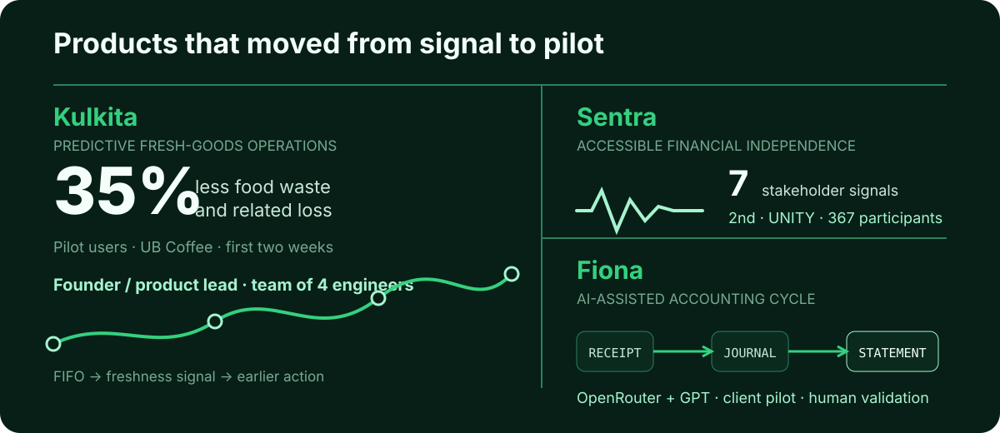
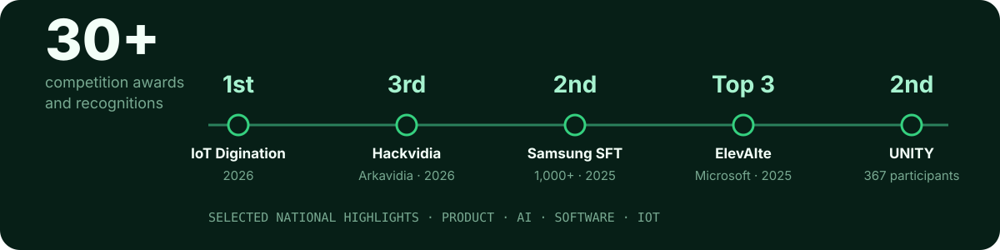

<!--
THESIS: Richard's profile is a visual evidence trail from messy workflow to measurable AI pilot.
OWN-WORLD: Deep forest surfaces, mint signals, operational linework, and restrained brand marks.
STORY: Position → product proof → roles → tool constellation → recognition → contact.
MOTION: The hero signal and tool constellation settle once; reduced-motion visitors receive the complete static composition.
-->

  <picture>
    <source media="(max-width: 1200px)" srcset="./assets/hero-mobile.svg" />
    
  </picture>

  
  

I turn manual, high-friction workflows into AI products that teams can test, measure, and trust—from discovery and technical PRDs to cross-functional delivery and pilot evaluation.

Currently an **iOS Developer in the Apple Developer Academy program** and an **Informatics Engineering student at Universitas Brawijaya** (expected 2027). Open to **AI Product Manager roles across Indonesia, Singapore, and global remote teams**.

## Product evidence

  <picture>
    <source media="(max-width: 1200px)" srcset="./assets/case-board-mobile.svg" />
    
  </picture>

- **Kulkita — Founder & product lead.** Led four engineers from discovery to MVP. Pilot users at UB Coffee reported **35% less food waste and related loss in two weeks**; the product secured **IDR 26M in non-dilutive funding**.
- **Sentra — Product lead.** Turned research with seven stakeholders into an accessible financial assistant MVP for visually impaired users; **2nd at UNITY** from 367 participants across 39 universities.
- **Fiona — AI Product Manager.** Translated accountant interviews into a technical PRD for a receipt-to-financial-statement workflow using **GPT through OpenRouter**. Now in a private client pilot with human validation.

## Selected roles

- **iOS Developer · Apple Developer Academy program — Present:** strengthening engineering execution through end-to-end iOS product development.
- **Product Manager · PT Ekanusa Solaris Digital — Part-time, remote:** delivered workflow automation that contributed to **40% fewer missed responses** and **50% faster handovers**.
- **AI Product Manager Intern · Pingtar — Remote:** internal pilots recorded **25% ops time saved**, **60% faster retrieval**, and **90%+ response accuracy**.

## Tool constellation

  <picture>
    <source media="(max-width: 1200px)" srcset="./assets/stack-constellation-mobile.svg" />
    
  </picture>

**Product:** Jira, Taiga, roadmaps, PRDs, and Scrum · **AI:** Gemini, Claude, Codex, GPT, and OpenRouter · **Build & data:** Swift, Python, and scikit-learn · **Design & automation:** Figma, Google Analytics, n8n, and Zapier.

## Recognition

  <picture>
    <source media="(max-width: 1200px)" srcset="./assets/recognition-strip-mobile.svg" />
    
  </picture>

Selected from **30+ competition awards and recognitions** across AI, product, software, and IoT—including Samsung Solve for Tomorrow, ElevAIte × Microsoft, UNITY, Hackvidia, and IoT Digination.

## GitHub activity

  

  <strong>Building an AI product or hiring an AI PM?</strong>  
  <a href="https://www.linkedin.com/in/richard05/">Let's connect on LinkedIn</a> · <a href="mailto:richardcen05@gmail.com">richardcen05@gmail.com</a>

